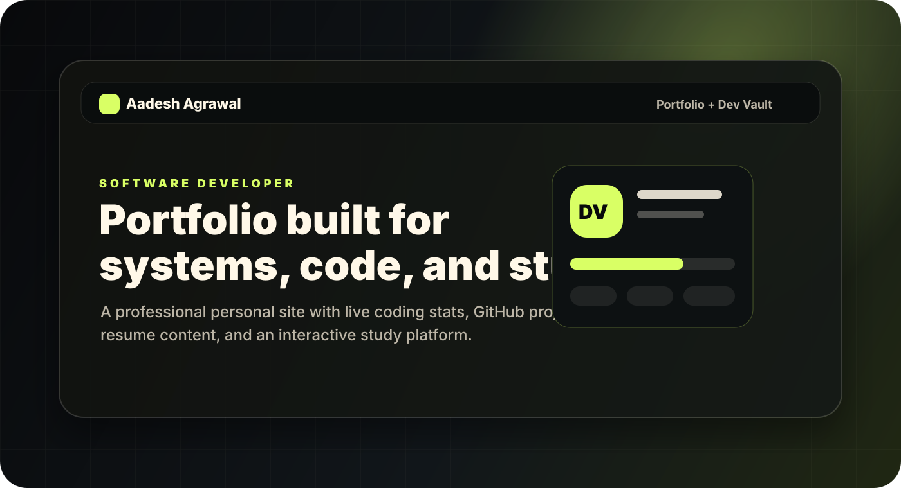
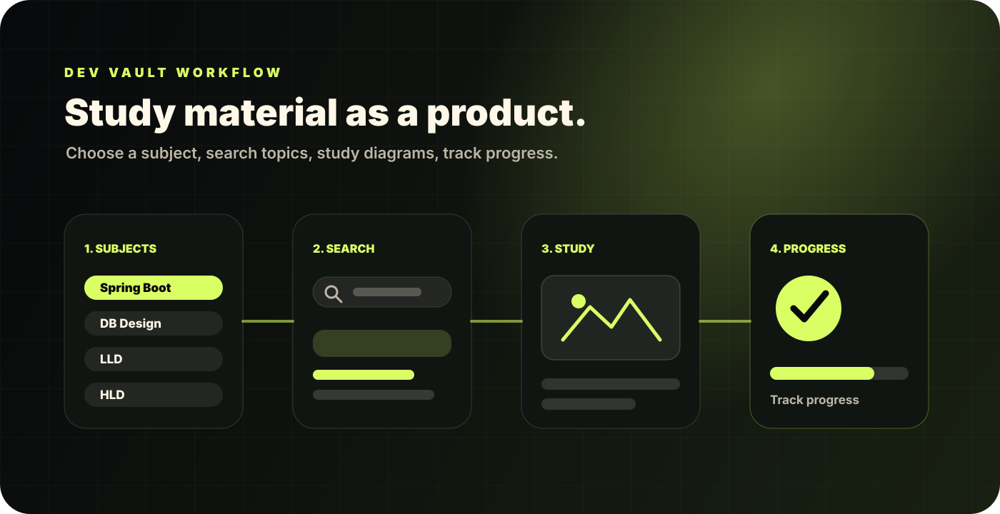

# Aadesh Agrawal Portfolio



A professional portfolio and study platform for **Aadesh Agrawal**. The site combines a polished personal portfolio with **Dev Vault**, an interactive study space for DSA, Spring Boot, DB Design, LLD, and HLD preparation.

The project is built as a static web app with modular JavaScript data files, CSS-heavy responsive design, live profile integrations, and reusable study content structures.

## Highlights

- Professional portfolio with profile, experience, skills, achievements, resume, projects, and contact sections.
- Live GitHub project cards with filtered repositories, repo detail pages, file lists, languages, clone/download actions, and README redirects.
- LeetCode and GFG problem-solving sections with progress, yearly activity, and coding platform stats.
- Dev Vault study site with subject navigation, progress tracking, topic completion, search, modals, diagrams, code blocks, and light/dark theme support.
- Fully responsive layout for desktop, laptop, tablet, and mobile screen sizes.
- Shared theme persistence between Portfolio and Dev Vault.

## Dev Vault



Dev Vault is the study-material section of the project. It behaves like a single-page app while staying static and lightweight.

Current subjects:

- **DSA**: placeholder section, ready for future content.
- **Spring Boot**: summarized backend course content from local notes, slides, and demo project references.
- **DB Design**: practical database design cases with requirements, solution diagrams, explanations, and video references.
- **LLD**: basics, design patterns, and machine-coding problems with diagrams, notes, code, and mapped video references.
- **HLD**: cheat-sheet section with searchable, collapsible system design topics.

Progress is stored locally in the browser, so users can mark topics as complete and continue later on the same device.

## Tech Stack

- **Frontend**: HTML, CSS, JavaScript
- **Styling**: responsive custom CSS, dark/light themes, animations, cards, modals, floating actions
- **Data model**: JavaScript configuration files under `src/data`
- **Integrations**: GitHub REST API, LeetCode stats/activity APIs, GFG stats APIs
- **Deployment**: static hosting, currently suitable for Vercel

## Project Structure

```text
.
├── index.html
├── devVault.html
├── me.png
├── assets/
│   ├── AadeshAgrawal-Resume.pdf
│   ├── readme/
│   │   ├── portfolio-overview.svg
│   │   └── dev-vault-map.svg
│   └── study/
│       ├── db-design/
│       ├── hld/
│       ├── lld/
│       └── spring/
└── src/
    ├── data/
    │   ├── portfolio-config.js
    │   ├── db-design.js
    │   ├── lld-content.js
    │   ├── lld-video-references.js
    │   ├── spring-boot.js
    │   ├── hld-cheatsheet.js
    │   └── course-topics.js
    ├── js/
    │   ├── portfolio.js
    │   └── dev-vault.js
    └── styles/
        ├── portfolio.css
        └── dev-vault.css
```

## Run Locally

This is a static site. You can open `index.html` directly, or serve the folder locally:

```bash
python3 -m http.server 3000
```

Then open:

```text
http://localhost:3000
```

Dev Vault is available at:

```text
http://localhost:3000/devVault.html
```

## Updating Content

Most frequently edited content lives in `src/data`. Keep behavior in `src/js` and content/config in `src/data` whenever possible.

| File | Purpose |
| --- | --- |
| `src/data/portfolio-config.js` | GitHub username, LeetCode/GFG IDs, featured repo hints, hidden repo filters |
| `src/data/db-design.js` | DB Design cases, requirements, diagrams, explanations, video links |
| `src/data/lld-content.js` | LLD topics, notes, diagrams, code samples, problem content |
| `src/data/lld-video-references.js` | Video mapping for LLD articles |
| `src/data/spring-boot.js` | Spring Boot modules, article summaries, visuals, code snippets |
| `src/data/hld-cheatsheet.js` | HLD cheat-sheet pages and diagram references |
| `src/data/course-topics.js` | Placeholder/future subject topic metadata |

## GitHub Repository Cards

The portfolio pulls repository data from GitHub and displays selected projects. The repo detail view intentionally redirects README content to GitHub instead of rendering raw markdown inside the portfolio. This keeps screenshots, badges, relative links, and GitHub-hosted images rendering correctly.

To tune repository visibility:

1. Update featured project names in `featuredRepoHints`.
2. Add personal/unwanted repo patterns to `hiddenRepoPatterns`.
3. Keep project descriptions updated on GitHub for better portfolio cards.

## Credits

Learning material in Dev Vault is organized for personal study and revision. Source credits are shown inside the relevant study sections.

- DB Design prompts are credited to **Ben Brumm** from Database Star.
- Spring Boot material is credited to **Chad Darby** and luv2code.
- LLD references include Coder Army, Shrayansh, and Shubh Patel resources.
- HLD cheat-sheet material is credited to **Anindya Sankar Dasgupta** from Interview With Bunny.

## Notes

- The project has no build step.
- The site uses browser `localStorage` for theme and study progress.
- External stats depend on public API availability and may fall back gracefully.
- Keep generated or large study assets under `assets/study` and editable text/config under `src/data`.
